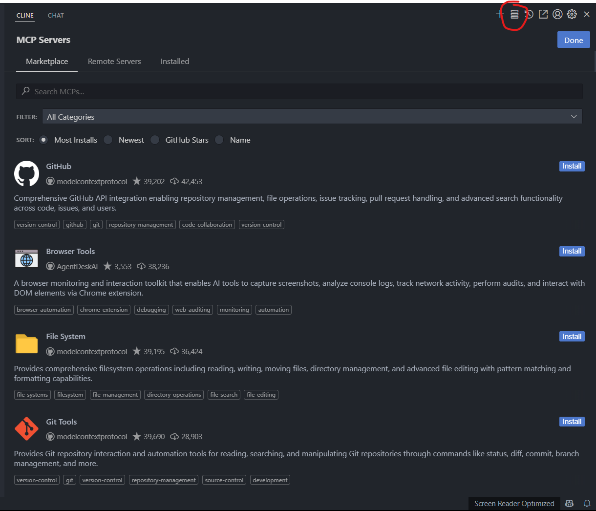
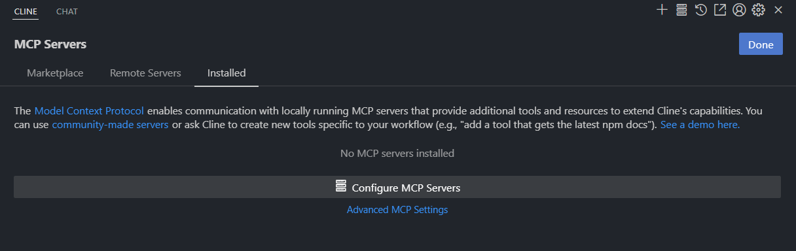
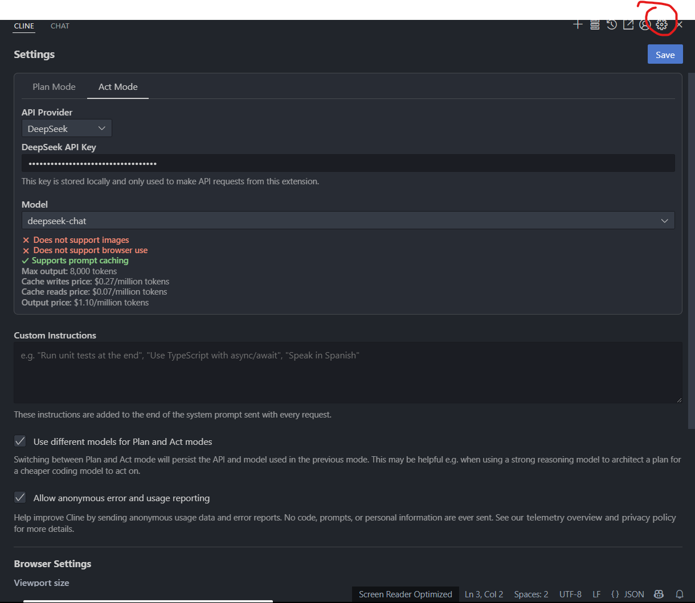
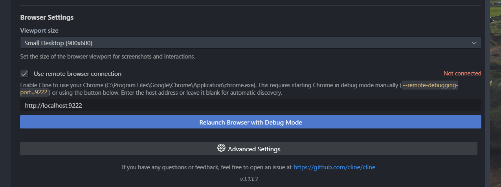
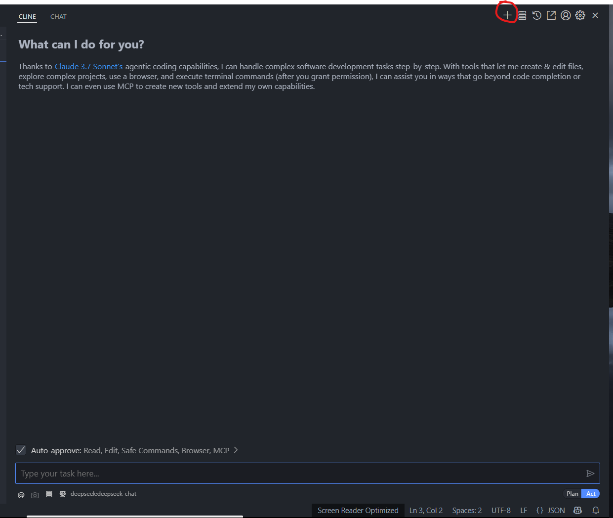

# SQL-Assistant

SQL-Assistant 是一个基于 [MCP协议](https://modelcontextprotocol.io/introduction) 构建的 MCP 服务.
通过将做 SQL 题目的一系列方法暴露给 AI, 再由用户对AI发出指令进行驱动，达到自动化做题的效果。
旨在简化大学生的操作, 让大学生从繁忙且无用的大学计算机教育中脱身, 花更少的时间完成任务，把时间留着学习真正的实用的技术。

对应的网站: [希冀](https://course.educg.net/), 且必须是其中的 SQL 作业.

## 下载方式
### 前置条件
- go 1.24.2 
  - [Windows](https://go.dev/dl/go1.24.2.windows-amd64.msi)
  - [MacOS ARM64](https://go.dev/dl/go1.24.2.darwin-arm64.pkg)
  - [MacOS x64](https://go.dev/dl/go1.24.2.darwin-amd64.pkg)
  - [Linux](https://go.dev/dl/go1.24.2.linux-amd64.tar.gz)
- vscode + cline 插件 (或其他可接入 MCP 服务的平台, 如 Claude Desktop、Gemini)
  - [vscode](https://code.visualstudio.com/)
- [Chrome](https://www.google.com/intl/en_hk/chrome/)

### 下载
```
go install github.com/crazyfrankie/sqlassistant
```
等待下载，下载成功后进行下一步配置.

### 配置
请确认已经准备好 vscode + cline 插件.
来到 Cline 的界面, 选择右上角, 会看到如下界面.


然后选择下方 `Installed`


再选择 `Configure MCP Servers`, 填写配置, 对于本项目, 一个基础的配置可采用如下方式:
```
{
  "mcpServers": {
    "sqlassistant": {
      "command": "sqlassistant.exe",
      "autoApprove": [
        "GetQuestion",
        "SetCode",
        "StartNum",
        "SubmitCode"
      ]
    }
  }
}
```
如不是 Windows 平台, 去掉 `"command": "sqlassistant.exe"` 中的exe后缀

配置完毕后, ctrl + s 保存该文件即可生效.

下一步, 配置 AI 模型. 来到设置界面:


选择想要使用的大模型, 并填入个人的 API Key

仍然是该界面, 滑到最下方


点击 `Relauch Browser with Debug Mode`, 并将上方 `Use Remote browser connection` 勾选.

此时会打开一个新的 Chrome 界面, 在该界面上打开数据库做题网站, 并登录, 登录成功后即可, 后续过程中不能关闭该界面。
## 使用
上述配置完成之后，来到聊天界面,


发送 prompt, 如下（仅参考）:
```
“我需要使用sqlassistant进行做题, 先输入起止题号，再循环执行 GetProblem、SetCode、SubmitCode，直到收到结束信息为止，其他失败原因都进行重试。”
```